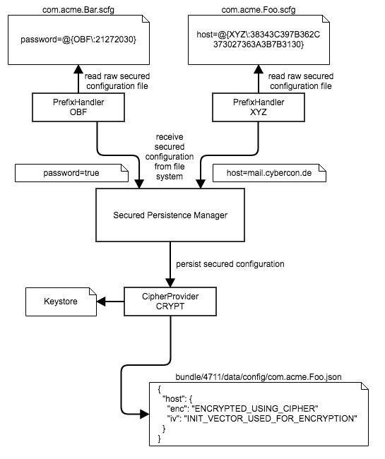

# eBX Crypto Config
## Introduction
A `bndly-application` stores OSGI configurations as plain text in the file system by default. This may be undesired, if the the configurations contain sensitive information such as passwords. In order to store such sensitive information in an encrypted format a `CipherProvider` can be configured. eBX ships with a default implementation, that converts the configuration information using cipher objects. The cipher is loaded from a JCEKS keystore, that is stored within the eBX _Crypto Config_ bundle. If a custom keystore shall be used, a custom implementation needs to be provided.

## Configuring the eBX CipherProvider
In order to make the `bndly-application` store secured configurations, the OSGI framework properties need to be set properly. The `org.bndly.common.osgi.config.SecuredPersistenceManagerImpl.cipherprovider` property refers to the `CipherProvider` by its alias. The eBX CipherProvider has the alias `CRYPT`. The CipherProvider will be used to persist secured configurations.

Secured configurations are identified by the suffix `.scfg`. Configurations ending with `.cfg` will be treated as non-sensitive. A secured configuration is a Java property file with a specific pattern for the values.

In order to create a secured configuration (`.scfg`) in the application provisioning the config needs to be declared with a `@SECURE` property. The `@SECURE` will refer to a prefix handler, that is able to deserialize the raw secured configuration. Here is an example:

```
"com.acme.MyComponent": {
	"@SECURE": "OBF",
	"property": "this value will be obfuscated"
}
```

The `OBF` prefix handler will simply obfuscate the plain values by applying an XOR byte mask on the plain value.

In order to start reading secured configurations only when all required prefix handlers are available, the OSGI framework property `org.bndly.common.osgi.config.impl.PrefixHandlerTracker.requiredHandlerNames` needs to be set.

So lets say we have this overall configuration:
- PrefixHandlers `OBF` and `CUSTOM` should be used for reading `.scfg` files
- CipherProvider `CRYPT` should be used for persisting secured configurations

Then the `config.properties` for the application will look like this:

```
# In order to enable a proper deserialization of *.scfg configuration files, the
# required prefix handlers for the configurations need to be explicitly listed.
# Multiple handlers should be separated by , as in the example below.
org.bndly.common.osgi.config.impl.PrefixHandlerTracker.requiredHandlerNames=OBF,CUSTOM

# In order to enable an encrypted storage of configurations, the cipher provider
# needs to be explicitly defined.
org.bndly.common.osgi.config.SecuredPersistenceManagerImpl.cipherprovider=CRYPT
```

### Difference between PrefixHandler and CipherProvider
The `PrefixHandler` interface is used to read raw secured configurations (`.scfg`) from the file system.
The `CipherProvider` interface is used to store a loaded secured configuration in the file system.

Within the application there can be multiple prefix handlers in use to read secured configuration files. All loaded secured configurations will be stored using a secured persistence manager, that will use exactly one `CipherProvider` for writing/reading secured configurations. The following diagram illustrates this design:



## Implementing a custom CipherProvider
A custom `CipherProvider` needs to be implemented in its own bundle. The class needs to implement `org.bndly.common.osgi.config.spi.CipherProvider`. The class is not a declarative service, but will be made available by using the Java `ServiceLoader` mechanism. This is done by adding a file `META-INF/services/org.bndly.common.osgi.config.spi.CipherProvider` in the bundle. The content of the file is the name of the implementing class.

In order to integrate the `ServiceLoader` mechanism with the OSGI concepts, the following headers need to be added to the `MANIFEST.MF` of the bundle:

```
Provide-Capability: osgi.serviceloader; osgi.serviceloader=org.bndly.c
 ommon.osgi.config.spi.CipherProvider,osgi.serviceloader; osgi.servicelo
 ader=org.bndly.common.osgi.config.spi.PrefixHandler
Require-Capability: osgi.extender; filter:="(osgi.extender=osgi.servicel
 oader.registrar)"
```

This can be done by using the Maven Bundle Plugin:

```
<plugin>
	<groupId>org.apache.felix</groupId>
	<artifactId>maven-bundle-plugin</artifactId>
	<configuration>
		<instructions>
			<Require-Capability>osgi.extender; filter:="(osgi.extender=osgi.serviceloader.registrar)"</Require-Capability>
			<Provide-Capability>osgi.serviceloader; osgi.serviceloader=org.bndly.common.osgi.config.spi.CipherProvider,osgi.serviceloader; osgi.serviceloader=org.bndly.common.osgi.config.spi.PrefixHandler</Provide-Capability>
		</instructions>
	</configuration>
</plugin>
```

Your implementing class can look similar to the following code. Please not that it will be up to you to provide the cipher. If the cipher is created from a contained keystore or if it is taken from a system property does not matter to the persistence manager, that uses the `CipherProvider`.

```
public class CipherProviderImpl implements CipherProvider {

	private static final SecretKey KEY;
	public static final String ALIAS = "CUSTOM";

	static {
		InputStream tmp = CipherProviderImpl.class.getClassLoader().getResourceAsStream("config.jceks");
		KEY = loadTheKeyFromTheKeystore(tmp);
	}

	@Override
	public final String getAlias() {
		return ALIAS;
	}

	@Override
	public Cipher restoreDecryptionCipher(String alias, String initVectorBase64) {
		if (!ALIAS.equals(alias) || KEY == null) {
			return null;
		}
		try {
			Cipher cipher = Cipher.getInstance("AES");
			if (initVectorBase64 != null) {
				cipher.init(Cipher.DECRYPT_MODE, KEY, new IvParameterSpec(Base64Util.decode(initVectorBase64)));
			} else {
				cipher.init(Cipher.DECRYPT_MODE, KEY);
			}
			return cipher;
		} catch (
				NoSuchAlgorithmException
				| NoSuchPaddingException
				| InvalidAlgorithmParameterException
				| InvalidKeyException ex
		) {
			LOG.error("could not set up cipher", ex);
			return null;
		}
	}

	@Override
	public Cipher restoreEncryptionCipher(String alias) {
		if (!ALIAS.equals(alias) || KEY == null) {
			return null;
		}
		try {
			Cipher cipher = Cipher.getInstance("AES");
			cipher.init(Cipher.ENCRYPT_MODE, KEY);
			return cipher;
		} catch (
				NoSuchAlgorithmException
				| NoSuchPaddingException
				| InvalidKeyException ex
		) {
			LOG.error("could not set up cipher", ex);
			return null;
		}
	}
}
```
