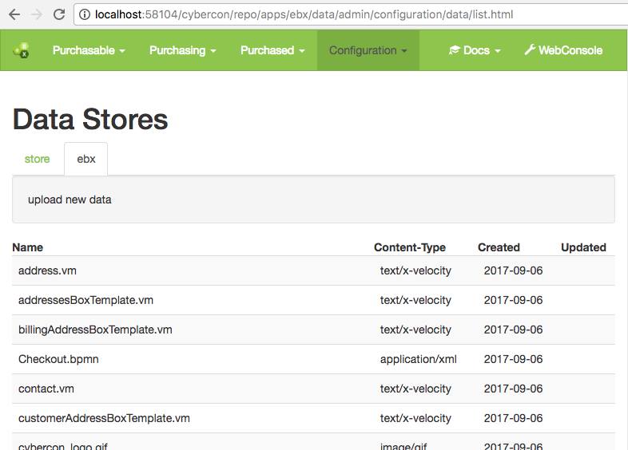

# eBX Data Provider
## Introduction
The eBX Data Provider bundle integrates eBX with the Velocity template rendering engine and the `DataStore` API.

## DataStore integration
The eBX Data Provider bundle provides an implementation of the `DataStore` API, that exposes instances of `BinaryData` entities as data objects. This way all services, that build up on the `DataStore` API can benefit from data stored in eBX. An example would be uploading and downloading data objects from a `DataStore` via the REST API. This is done in an independent implementation, that uses the `DataStore` API.

It is important to note, that eBX allows multiple `BinaryData` instances with the same name. The `DataStore` API treats the name of a data object as a unique identifier. The eBX Data Store will therefore pick the first `BinaryData` entity, that matches with a data name, as the entity to expose as a data object.

In order to browse the eBX Data Store the admin UI or REST API of eBX can be used. The admin UI is available at `/bndly/repo/apps/ebx/data/admin/configuration/data/list.html`. The REST API of the `DataStore` API is available via `/bndly/data/ebx` for the eBX Data Provider or just `/bndly/data` for all Data Providers.



## Velocity template rendering
The eBX Data Provider bundle provides an implementation of `VelocityDataProvider`, that will read Velocity resources from a file system folder. In order to activate this velocity data provider a `org.bndly.ebx.dataprovider.FileVelocityDataProvider` config needs to be present. The config contains a `root` property, that defines the root folder for looking up resources in the file system. The config also contains a `name` property, that will be interpreted as a prefix for looked up resources. Here is an example configuration:

```
root=/home/ebx/velocity
name=ebxfs
```

The `VelocityDataProvider` will only be called, if Velocity is trying to look up a resource with a name, that starts with `ebxfs/`.